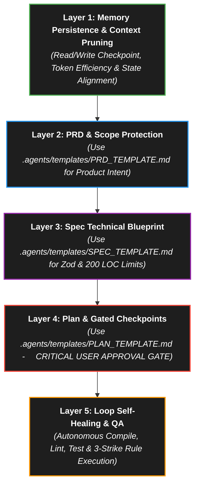

# 🤖 Enterprise-Cognitive Agent Stack Execution Engine (v9.0 SDD)

> **Objective:** Eliminate context drift, maximize token efficiency, and enforce a high-fidelity self-healing standard by binding execution to a strict 5-layer Enterprise Specification-Driven Development (SDD) Engine. This guarantees zero-drift autonomous execution and over 95% error mitigation compared to reactive setups.

Whenever you are tasked with a feature or long-running objective, you **MUST** execute the task strictly using the following 5-layer Agent Stack methodology.

---

## 🏗️ The 5-Layer Architecture (v9.0 SDD)

---

## 🚀 Execution Steps

### 1️⃣ Layer 1 — Memory Persistence & Context Pruning (`ARCHITECTURE_STATE.md` / `latest.md`)
- **Protocol:** Parse `latest.md` and `ARCHITECTURE_STATE.md` at the start of every session. Save progress, completed milestones, and updated metrics automatically to `latest.md`, `task.md`, `ARCHITECTURE_STATE.md`, and `SPRINTS.md` at the end of each step without waiting for user prompts.
- **Token Optimization:** Do not re-read large directory or file structures repeatedly. Rely on summaries from `latest.md` and `ARCHITECTURE_STATE.md`.
- **JIT Skill Activation:** Load only the specific Skill markdown file relevant to the current task from `.agents/Skills/` to save context window space.

### 2️⃣ Layer 2 — PRD & Scope Protection (`.agents/templates/PRD_TEMPLATE.md`)
- **Protocol:** Define product scope, user personas, Liquid Glass 4.0 layout parameters, and evaluation criteria using `.agents/templates/PRD_TEMPLATE.md`.
- **Screen Awareness:** Verify active route, UI View State, or screen context before starting layout edits. Enforce 120Hz zero-reflow GPU performance constraints.

### 3️⃣ Layer 3 — Spec Technical Blueprint (`.agents/templates/SPEC_TEMPLATE.md`)
- **Protocol:** Establish Zod schema boundaries, strict 200 LOC file isolation, and Server Action contracts using `.agents/templates/SPEC_TEMPLATE.md`.
- **200 LOC Ceiling:** Enforce a strict physical maximum of **200 lines of code** per file. Decompose larger assets into sub-components or utility hooks.
- **Zero Client Exposure & Zero Runtime MCP:** Ensure database credentials exist strictly in server `.env` variables, and all features run natively without runtime MCP dependency.

### 4️⃣ Layer 4 — Plan & Gated Checkpoints (`.agents/templates/PLAN_TEMPLATE.md`)
- **Protocol:** Break down execution into isolated tasks tracked in `.agents/task.md` using `.agents/templates/PLAN_TEMPLATE.md`.
- 🔴 **CRITICAL GATEKEEPER:** The agent must halt coding activities, output the `implementation_plan.md` artifact, and wait for explicit user approval before modifying or creating any code files.

### 5️⃣ Layer 5 — Loop Self-Healing & QA (Loop)
- **Protocol:** Compile the project (`npx tsc --noEmit`), run linter and build scripts (`npm run build`), and execute unit tests (`npx vitest run`) after every batch of edits.
- **The 3-Strike Rule:** If a build, compile, or test failure occurs, analyze the terminal logs and fix the code autonomously. If the same error persists for **3 consecutive attempts**, HALT, write a diagnostic summary in `latest.md`, and prompt the user for manual intervention.
