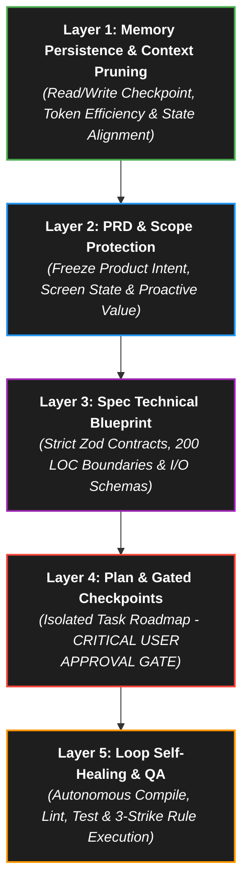

# 🤖 Enterprise-Cognitive Agent Stack Execution Engine (v8.0)

> **Objective:** Eliminate context drift, maximize token efficiency, and enforce a high-fidelity self-healing standard by binding execution to a strict 5-layer Enterprise-Cognitive Engine. This guarantees zero-drift autonomous execution and over 90% error mitigation compared to reactive setups.

Whenever you are tasked with a feature or long-running objective, you **MUST** execute the task strictly using the following 5-layer Agent Stack methodology.

---

## 🏗️ The 5-Layer Architecture (v8.0)

---

## 🚀 Execution Steps

### 1️⃣ Layer 1 — Memory Persistence & Context Pruning (`ARCHITECTURE_STATE.md` / `latest.md`)
- **Protocol:** Parse `latest.md` and `ARCHITECTURE_STATE.md` at the start of every session. Save progress, completed milestones, and updated metrics to `SPRINTS.md` at the end of each step.
- **Token Optimization:** Do not re-read large directory or file structures repeatedly. Rely on summaries from `latest.md` and `ARCHITECTURE_STATE.md`.
- **JIT Skill Activation:** Load only the specific Skill markdown file relevant to the current task from `.agents/Skills/` to save context window space.

> **Mandatory System Prompt Template:**
> *"Maintain all structural context within a unified Markdown target file. Parse this state contract comprehensively before executing any operation. Keep token usage optimized by avoiding redundant reads."*

### 2️⃣ Layer 2 — PRD & Scope Protection
- **Protocol:** Define product scope, user personas, and design standards. Reject ambiguous features or undocumented assumptions.
- **Screen Awareness:** Verify the current active route, UI View State, or screen context before starting layout edits. Keep design aligned to the **Liquid Glass 4.0** standard (120Hz performance, zero-reflow transforms, high optical depth).

> **Mandatory System Prompt Template:**
> *"Write a lean PRD defining the core product scope, target user persona, screen context, and Liquid Glass 4.0 layout parameters."*

### 3️⃣ Layer 3 — Spec Technical Blueprint (Spec)
- **Protocol:** Establish systemic schemas, strict interface contracts, and error states.
- **200 LOC Ceiling:** Enforce a strict physical maximum of **200 lines of code** per file. Decompose larger assets into sub-components or utility hooks.
- **Data Boundary Validation:** Enforce type-safe operations using **Zod schemas** at all database and API boundaries.
- **Zero Client Exposure:** Ensure sensitive credentials, API keys, and MongoDB connection strings exist only in server-side `.env` variables and never in client bundles or logs.

> **Mandatory System Prompt Template:**
> *"Formulate a deep technical blueprint covering Zod schema boundaries, 200 LOC file limits, server actions, client interfaces, and explicit error-handling models."*

### 4️⃣ Layer 4 — Plan & Gated Checkpoints (Plan)
- **Protocol:** Break down execution into isolated tasks with checklist items tracked in the workspace task ledger `.agents/task.md`.
- 🔴 **CRITICAL GATEKEEPER:** The agent must halt coding activities, output the `implementation_plan.md` artifact, and wait for explicit user approval before modifying or creating any code files.

> **Mandatory System Prompt Template:**
> *"Construct an isolated, granular task list in .agents/task.md. Halt execution completely, generate implementation_plan.md, and wait for explicit manual authorization prior to file creation or modification."*

### 5️⃣ Layer 5 — Loop Self-Healing & QA (Loop)
- **Protocol:** Compile the project (`npx tsc --noEmit`), run linter and build scripts (`npm run build`), and execute unit tests (`npx vitest run`) after every batch of edits.
- **The 3-Strike Rule:** If a build, compile, or test failure occurs, analyze the terminal logs and fix the code autonomously. If the same error persists for **3 consecutive attempts**, HALT, write a diagnostic summary in `latest.md`, and prompt the user for manual intervention.

> **Mandatory System Prompt Template:**
> *"Execute compilation and test routines autonomously in a self-healing loop. If a failure repeats 3 times, write diagnostics to latest.md and halt for user input."*
