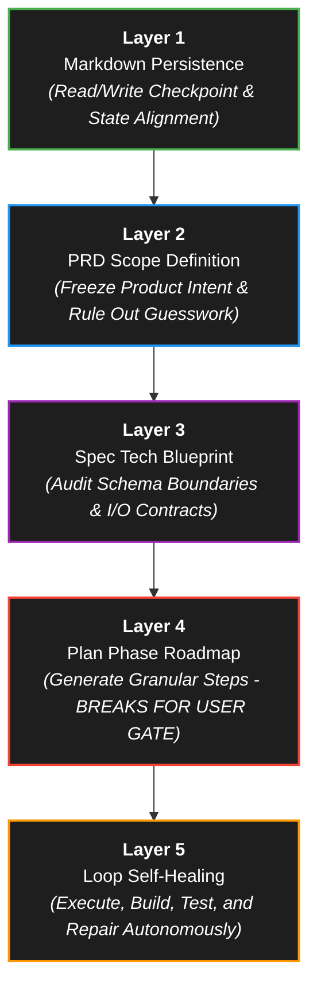

# 🤖 Agent Stack Execution Engine (v6.2)

> **Objective:** Eliminate systemic context drift and session amnesia during long-duration autonomous code execution by binding to a strict 5-layer execution engine. This methodology guarantees over 80% error mitigation compared to unharnessed multi-agent swarm setups.

Whenever you are tasked with a complex feature or long-running objective, you **MUST** execute the task strictly using the following Agent Stack methodology.

---

## 🏗️ The 5-Layer Architecture

---

## 🚀 Execution Steps

### 1️⃣ Layer 1 — Markdown Persistence (`STATE.md` / `latest.md`)
- **Protocol:** The agent must parse this file at the absolute initiation of every work block. Record active milestones and update session metrics immediately upon completing sub-tasks to guarantee context continuity across environment resets.
- **Crucial Integration:** Query available MCP servers (`StitchMCP`, `notebooklm`, `mcp-obsidian`, `mongodb-mcp-server`, `github-mcp-server`) for necessary context before initiating any planning.

> **Mandatory System Prompt Template:**
> *"Maintain all structural context within a unified Markdown target file. Parse this state contract comprehensively before executing any operation."*

### 2️⃣ Layer 2 — PRD Scope Definition
- **Protocol:** Establishes product definitions and target personas. The agent is explicitly barred from implementing capabilities that rely on ambiguous parameters or undocumented user assumptions.

> **Mandatory System Prompt Template:**
> *"Write a lean PRD defining the core product scope, target user persona, and structural baseline requirements."*

### 3️⃣ Layer 3 — Technical Blueprint (Spec)
- **Protocol:** Establishes systemic schemas, strict interface contracts, and error conditions (e.g., token timeouts, database partition breaks) before generating any functional file modifications.

> **Mandatory System Prompt Template:**
> *"Formulate a deep technical blueprint covering API boundaries, strict data inputs, explicit outputs, and comprehensive edge-case handling routines."*

### 4️⃣ Layer 4 — Step-by-Step Roadmap (Plan)
- **Protocol:** Breaks down execution into isolated tasks with clear validation flags.
- 🔴 **CRITICAL GATEKEEPER:** The agent must pause execution and request manual user sign-off via an `implementation_plan.md` artifact prior to modifying any physical code files.

> **Mandatory System Prompt Template:**
> *"Construct an isolated, granular task list with deterministic checkpoints. Pause execution completely and prompt for explicit manual authorization prior to file creation or modification."*

### 5️⃣ Layer 5 — Self-Healing Execution Engine (Loop)
- **Protocol:** Once authorized, the agent compiles code, evaluates terminal trace logs, runs internal vitest hooks, and corrects compilation anomalies autonomously until all validation assertions pass without needing human intervention.
- 🛠️ **Strict Testing Rule:** Execute static type checking (`npx tsc --noEmit`) and UI build scripts (`npm run build`) upon every single file generation batch to trap runtime regressions instantly.

> **Mandatory System Prompt Template:**
> *"Execute compilation routines autonomously in a self-healing loop. Evaluate log traces, run vitest verification blocks, and repair anomalies until error states are clear."*
