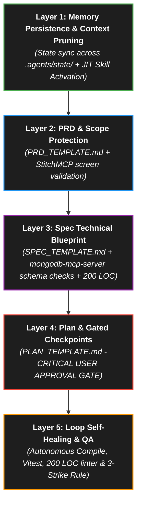

# 🤖 Enterprise-Cognitive Agent Stack Execution Engine (v10.0 SDD & MCP)

> **Objective:** Eliminate context drift, maximize token efficiency, and enforce a high-fidelity self-healing standard by binding execution to a strict 5-layer Enterprise Specification-Driven Development (SDD) Engine with dynamic MCP server orchestration.

Whenever you are tasked with a feature or long-running objective, you **MUST** execute strictly using the following 5-layer methodology.

---

## 🏗️ The 5-Layer Architecture (v10.0 SDD)

```mermaid
graph TD
    L1["<b>Layer 1: Memory Persistence & Context Pruning</b><br/><i>(State sync across .agents/state/ + JIT Skill Activation)</i>"] --> L2
    L2["<b>Layer 2: PRD & Scope Protection</b><br/><i>(PRD_TEMPLATE.md + StitchMCP screen validation)</i>"] --> L3
    L3["<b>Layer 3: Spec Technical Blueprint</b><br/><i>(SPEC_TEMPLATE.md + mongodb-mcp-server schema checks + 200 LOC)</i>"] --> L4
    L4["<b>Layer 4: Plan & Gated Checkpoints</b><br/><i>(PLAN_TEMPLATE.md - 🔴 CRITICAL USER APPROVAL GATE)</i>"] --> L5
    L5["<b>Layer 5: Loop Self-Healing & QA</b><br/><i>(Autonomous Compile, Vitest, 200 LOC linter & 3-Strike Rule)</i>"]
    
    style L1 fill:#1e1e1e,stroke:#4caf50,stroke-width:2px,color:#fff
    style L2 fill:#1e1e1e,stroke:#2196f3,stroke-width:2px,color:#fff
    style L3 fill:#1e1e1e,stroke:#9c27b0,stroke-width:2px,color:#fff
    style L4 fill:#1e1e1e,stroke:#f44336,stroke-width:2px,color:#fff
    style L5 fill:#1e1e1e,stroke:#ff9800,stroke-width:2px,color:#fff
```

---

## 🚀 Execution Steps & MCP Tool Integration

### 1️⃣ Layer 1 — Memory Persistence & Context Pruning
- **Protocol:** Parse `.agents/state/latest.md` and `.agents/state/ARCHITECTURE_STATE.md` at session start. Update all 4 state files (`task.md`, `latest.md`, `ARCHITECTURE_STATE.md`, `SPRINTS.md`) automatically after each milestone.
- **JIT Skill Activation:** Load only task-relevant skills from `.agents/skills/` to preserve context window capacity.
- **MCP Sync:** If syncing knowledge capsules or session memory, utilize `mcp-obsidian` tools.

### 2️⃣ Layer 2 — PRD & Scope Protection (`.agents/templates/PRD_TEMPLATE.md`)
- **Protocol:** Define product scope, user personas, Liquid Glass 4.0 layout, and 120Hz GPU constraints.
- **UI Prototyping:** Leverage `StitchMCP` (`list_screens`, `get_screen`, `generate_variants`) to audit UI layouts before implementing code.

### 3️⃣ Layer 3 — Spec Technical Blueprint (`.agents/templates/SPEC_TEMPLATE.md`)
- **Protocol:** Define Zod schemas, Server Action contracts, and model boundaries.
- **Strict 200 LOC Ceiling:** Every component, hook, or action file MUST NOT exceed 200 physical lines.
- **Database Boundary:** Inspect collections via `mongodb-mcp-server` (`collection-schema`, `collection-indexes`). Keep database credentials strictly server-side (`lib/db.ts`).

### 4️⃣ Layer 4 — Plan & Gated Checkpoints (`.agents/templates/PLAN_TEMPLATE.md`)
- **Protocol:** Decompose work into atomic steps tracked in `.agents/state/task.md`.
- 🔴 **CRITICAL USER APPROVAL GATE:** Stop coding and present the `implementation_plan.md` artifact. Wait for user approval before modifying code.
- 🔴 **GITHUB PUSH GATE:** Never push or commit to GitHub via `github-mcp-server` or git CLI without explicit user consent.

### 5️⃣ Layer 5 — Loop Self-Healing & QA
- **Automated Verification:**
  1. **Type Safety:** Run `npx tsc --noEmit` (0 errors required).
  2. **Unit & Integration Tests:** Run `npx vitest run` (100% pass rate required).
  3. **Build Check:** Run `npm run build` when touching page routes.
- **The 3-Strike Rule:** Autonomously debug and fix compilation or test failures. If the same error repeats 3 times, HALT, log diagnostics in `.agents/state/latest.md`, and request user guidance.
