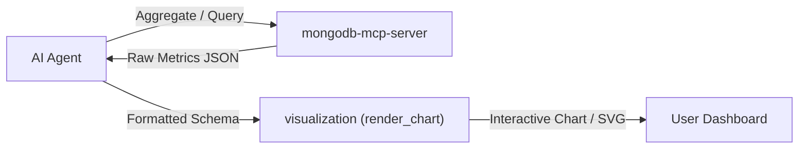

# 📈 CinePulse Live Analytics & BI Engine (MongoDB & Visualization MCP)

Autonomous business intelligence and revenue reporting engine operating directly on CinePulse production MongoDB collections via MCP tooling, with instant chart generation.

---

## 1. MCP Server Integration Architecture



---

## 2. Core Collections & Primary Metrics

| Collection | Key Fields | Target Analytics |
|---|---|---|
| `orders` | `totalAmount`, `status`, `createdAt`, `userId` | Gross Merchandise Value (GMV), Revenue per day/week |
| `tickets` | `movieId`, `showtimeId`, `seatId`, `tier`, `price` | Occupancy rates, popular showtimes, seat tier distribution |
| `concessions` | `items`, `totalCost`, `vipBundle` | Food & beverage attach rates, VIP combo preferences |
| `movies` | `title`, `genre`, `rating`, `duration` | Box-office leaders, genre performance correlation |

---

## 3. MongoDB MCP Aggregation Pipelines

### A. Top Grossing Movies (Pipeline)
```json
[
  { "$match": { "status": "CONFIRMED" } },
  { "$unwind": "$tickets" },
  { "$group": {
      "_id": "$tickets.movieTitle",
      "totalRevenue": { "$sum": "$tickets.price" },
      "ticketsSold": { "$sum": 1 }
    }
  },
  { "$sort": { "totalRevenue": -1 } },
  { "$limit": 10 }
]
```

### B. Daily Revenue & Attendance Velocity
```json
[
  {
    "$group": {
      "_id": { "$dateToString": { "format": "%Y-%m-%d", "date": "$createdAt" } },
      "dailyRevenue": { "$sum": "$totalAmount" },
      "orderCount": { "$sum": 1 }
    }
  },
  { "$sort": { "_id": 1 } }
]
```

---

## 4. Visualization MCP Chart Synthesis (`render_chart`)

When the user requests charts or visual reporting, map aggregated data to `visualization` tool schema:

```json
{
  "chart_type": "bar",
  "title": "הכנסות לפי סרט (בשקלים)",
  "x_axis": { "label": "שם הסרט", "categories": ["חולית 2", "גלדיאטור 2", "אופנהיימר"] },
  "series": [
    { "name": "הכנסה ב-₪", "data": [48500, 39200, 31000] }
  ]
}
```

---

## 5. Security & Isolation Rules
- **Read-Only Analytics:** Always prefer read-only aggregation (`mongodb-mcp-server:aggregate` or `aggregate-db`). Never run update or delete commands during analytics workflows.
- **Data Anonymization:** Never export or visualize personally identifiable information (`email`, `phone`, `passwords`).
- **Currency & Direction:** All monetary amounts are formatted with ILS symbol (`₪`) and aligned RTL.
